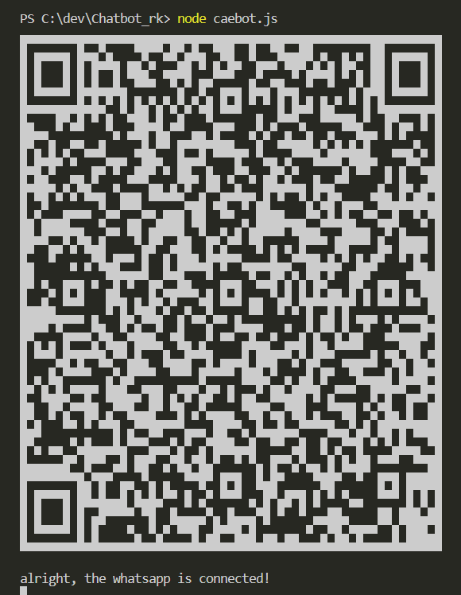
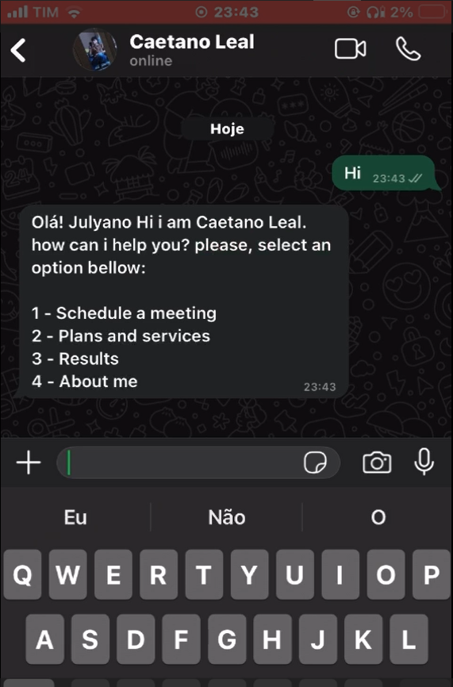
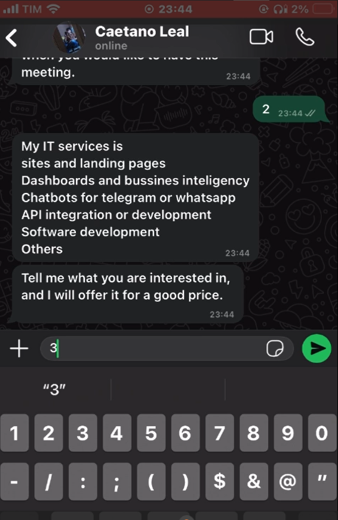

This chatbot has several trigger messages for activation. When a user sends an activation message to the user's private chat, the bot will send a greeting message and ask the user to choose one of the available options. Each selected option will result in a different response from the chatbot.

A QR code will be generated and displayed. Scan the code with WhatsApp on your phone to authenticate. After authentication, the bot will send a confirmation message in the terminal and will be ready to receive and respond to messages.

  

  After this, the bot will be up and running.
  

    
    
  

This chatbot shown in my portfolio is configured to introduce itself only as a demonstration. I usually sell WhatsApp chatbots, using the same base while customizing messages and occasionally adding new logic and rules depending on the client’s needs. If you have a background in IT and are interested, check out my repository with this code: https://github.com/CaetanoLeal/ChatBotWhatsapp.
