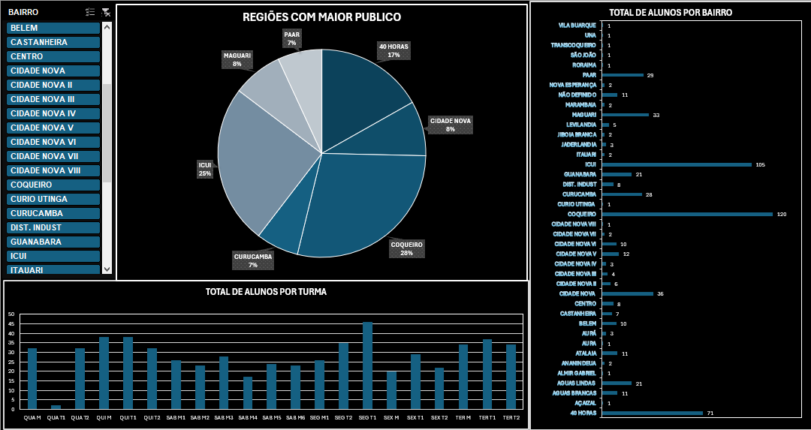

When creating dashboards, I always tailor them to my client's needs. Sometimes, I create databases with SQL for the client to input the data that needs analysis, or I receive the information from a spreadsheet or database. I am always responsible for data analysis and processing, ensuring convenience for the client.

  

I work with BI dashboards and have expertise in the most powerful tool for this purpose, Power BI. Additionally, I am a skilled data analyst, always ensuring the integrity of my clients' data. Check out one of my BIs below:
  

    
  

  However, I am not limited to creating BI dashboards using my favorite tool, Power BI. I also have knowledge of other data analysis and manipulation tools such as Jaspersoft and Excel, which is the most widely used software by companies. Below, I share a dashboard I created in Excel to analyze the number of students per neighborhood at a school where I worked:
   

     
   

Unfortunately, due to data restrictions, I have limited authorization to share the dashboards I created throughout my career on this website. However, my goal is simply to demonstrate my expertise in the field.
