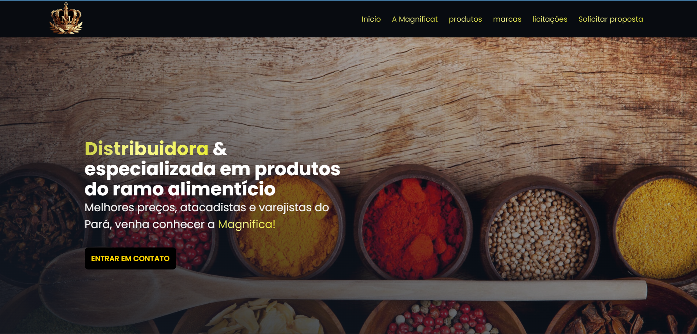
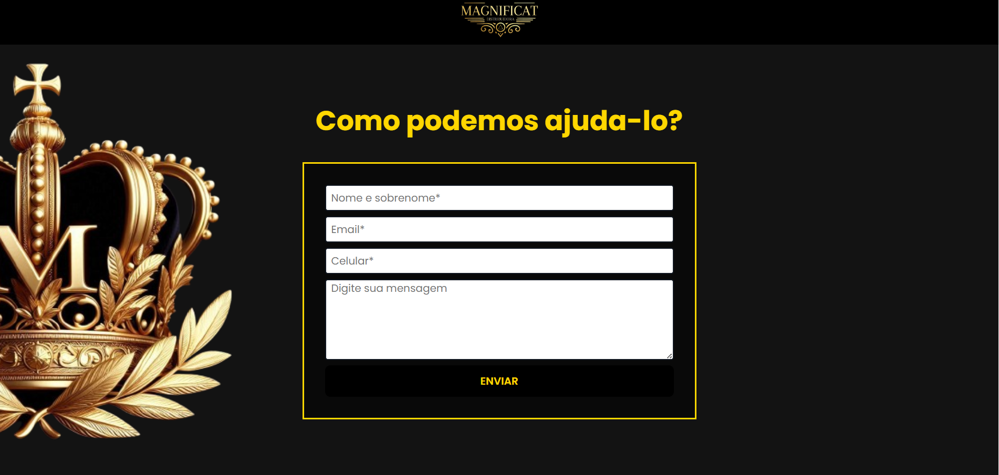
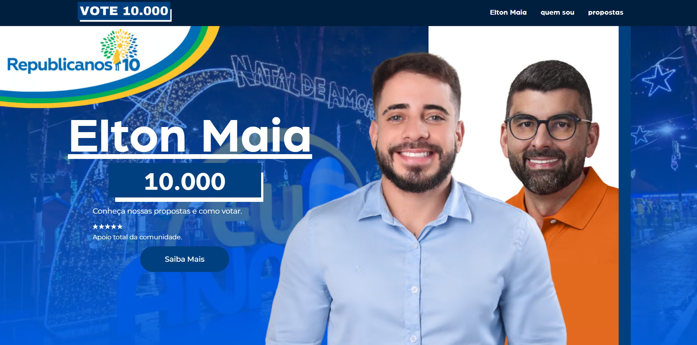
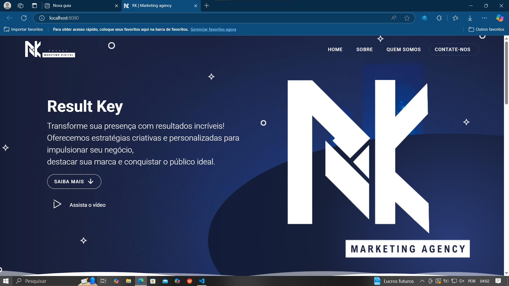
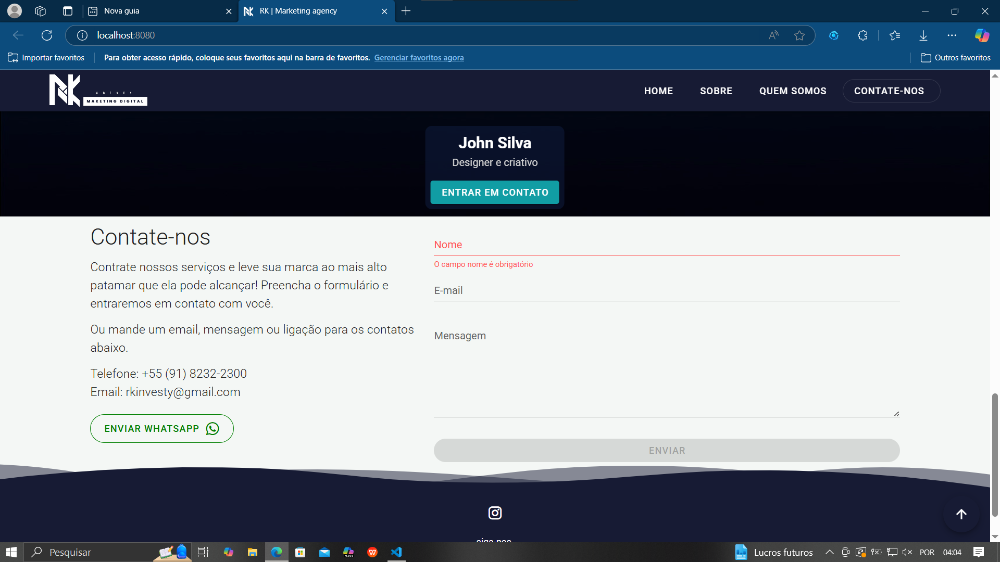
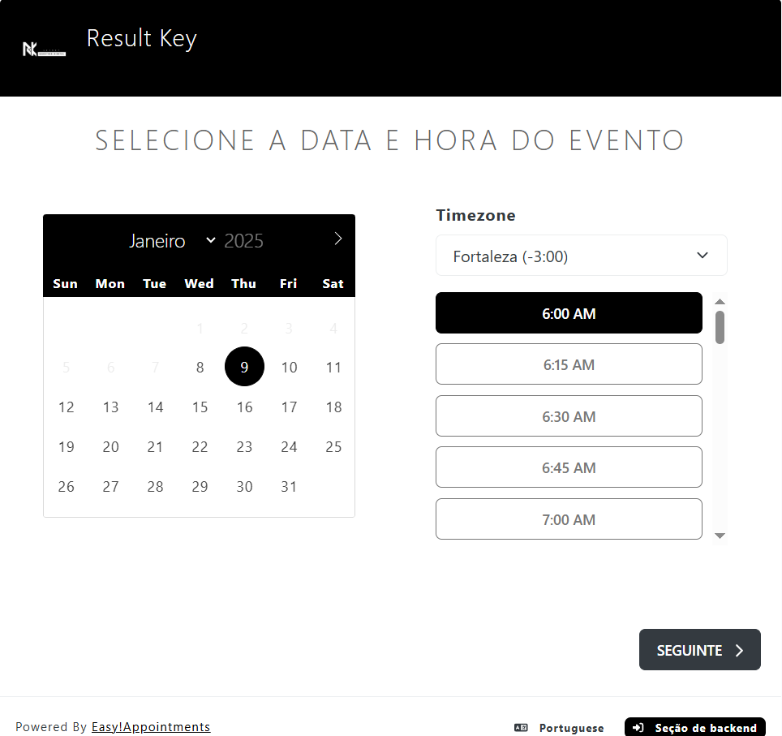

  
  

  Website created for Leal Sistemas, where I worked for two years. The site features an email sending API for contact. Website link: https://www.lealsistemas.com/

  
  

  Website I created for a spice distribution company called Magnificat. The company is one of the clients of Leal Sistemas. This website also features an email API, and its link is: https://www.magnificat-distribuidora.com.br/
 

  

  Website created for a councilor's campaign. The site was built with WordPress to ensure quick delivery and high-quality content. Unfortunately, the site was only live during the election campaign and is no longer accessible

  
  
  

  Website created for the marketing agency I worked for. The site includes various features such as a team carousel, an email-sending API, and an automated online booking system for consultations or meetings with the company, all within a user-friendly interface. Unfortunately, the site is not live at the moment, but the company plans to launch it soon.
